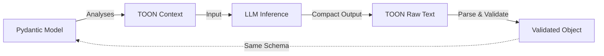

# TOON Output Parser for LangChain 🚀

A high-performance, cost-efficient structured output parser that uses **TOON (Token-Oriented Object Notation)** to reduce LLM token costs by **up to 97%**.

[](https://www.python.org/downloads/)
[](https://github.com/langchain-ai/langchain)
[](https://docs.pydantic.dev/)

## 🌟 Why TOON?

LLMs are optimized for tokens. JSON is verbose and requires significant "Format Instruction" (Input) tokens and structural overhead (Output) tokens. TOON is designed to be as compact as possible while remaining 100% compatible with Pydantic models.

### 📊 Real-World Benchmarks (Actual Logs)

| Scenario | Input (Instructions) | Output (Data) | **Total Token Savings** |
| :--- | :---: | :---: | :---: |
| **Function Calling (Tools)** | **-97.7%** | **-90.2%** | **97.2%** ✅ |
| **Intent Classification** | -80.8% | -17.4% | **71.2%** ✅ |
| **Large Table (100 items)** | - | - | **Fast (50k/sec)** ✅ |
| **Complex Nested (Depth 3)** | -95.4% | -35.0% | **64.3%** ✅ |

---

## 🌟 The Core Concept & Workflow

TOON was developed to bridge the gap between **Rigid Reliability (JSON)** and **Token Efficiency (TOON)**. It allows you to maintain clean, validated models in your code while the LLM communicates in a "compressed" format.

### Step-by-Step Transformation:

1.  **Define (JSON/Pydantic)**: You define your data structure using standard Pydantic models (your source of truth).
2.  **Translate (Metadata/Context)**: The parser analyzes your model and provides a **minimal TOON guideline** to the LLM (Input tokens saved).
3.  **Inference (TOON)**: The LLM generates data in the ultra-compact TOON format, skipping quotes, brackets, and redundant keys (Output tokens saved).
4.  **Restore (Validation)**: The parser takes the TOON raw text, transforms it back into a dictionary, and validates it against your original Pydantic model.



---

## 🧩 What is TOON Syntax?

TOON (Token-Oriented Object Notation) is a simplified, indentation-based format designed specifically for LLM extraction. It minimizes structural tokens (brackets, quotes, commas) to save costs.

### 1. Basic Key-Value & Nesting
Uses **2-space indentation** (no tabs). Every line ends with a colon `:`.
```toon
name: John Doe
age: 30
address:
  city: Seoul
  zip: 12345
```

### 2. Array Formats (The Cost Savers)
TOON provides three ways to represent lists, choosing the most compact one automatically:

- **Dash List** (Standard for objects):
  ```toon
  items:
    - name: Item 1
    - name: Item 2
  ```
- **Inline Scalar List** (For simple values):
  ```toon
  tags[3]: red,green,blue
  ```
- **Tabular Array** (The "Killer Feature" for tables):
  Reduces repetitive keys in lists of objects by using a CSV-like header.
  ```toon
  # Schema: List of {name, price}
  products[2,]{name,price}:
    iPhone 15,1200000
    Galaxy S24,1100000
  ```

---

## 🛠️ Performance & Support Matrix

| Feature | Support | Mode | Note |
| :--- | :---: | :---: | :--- |
| **Scalars** | ✅ Full | Minimal | str, int, float, bool, None. |
| **Special Chars** | ✅ Full | Adaptive | `:` and `-` supported via quoting. |
| **Union Types** | ✅ Full | Adaptive | `Union[int, str, ...]` handled robustly. |
| **Deep Nesting** | ✅ Full | Adaptive | Indentation-based (2 spaces). |
| **Tabular Arrays** | ✅ Full | Adaptive | `items[N,]{f1,f2}:` for maximum compression. |
| **Recursive Model** | ✅ Auto | **JSON** | Automatically switches to JSON for safety. |
| **Dot Notation** | ❌ No | - | Fails on `key.nested: val`. Use indentation. |

---

## 🚀 Getting Started

### Installation
```bash
pip install -e .
# Or with OpenAI extras
pip install -e ".[openai]"
```

### Basic Usage

#### 1. Define Model & Parser
```python
from toon_langchain_parser import ToonOutputParser
from pydantic import BaseModel, Field

class UserInfo(BaseModel):
    name: str = Field(..., description="User's full name")
    age: int = Field(..., description="User's age")
    hobbies: list[str] = Field(default_factory=list, description="List of hobbies")

# ToonOutputParser automatically chooses the best mode (minimal, adaptive, or json)
parser = ToonOutputParser(model=UserInfo)
```

#### 2. Configure Prompt & LLM
```python
from langchain_openai import ChatOpenAI
from langchain_core.prompts import ChatPromptTemplate

llm = ChatOpenAI(model="gpt-4o-mini", temperature=0)

# IMPORTANT: Include {format_instructions} in your prompt
prompt = ChatPromptTemplate.from_messages([
    ("system", "You are a helpful assistant."),
    ("human", "Describe {input}\n\n{format_instructions}")
])

format_instructions = parser.get_format_instructions()
```

#### 3. Execution Options

**Option A: Clean LCEL (Recommended)**
```python
chain = prompt | llm | parser
result = chain.invoke({
    "input": "John, 25 years old, likes soccer and coding.",
    "format_instructions": format_instructions
})
print(result) # UserInfo(name='John', age=25, hobbies=['soccer', 'coding'])
```

**Option B: Manual Parsing (For Debugging/Cost Analysis)**
```python
from langchain_core.output_parsers import StrOutputParser
from toon_langchain_parser import CostAnalyzer

# Chain returns raw TOON string
chain = prompt | llm | StrOutputParser()
raw_output = chain.invoke({
    "input": "John, 25 years old, likes soccer and coding.",
    "format_instructions": format_instructions
})

# Parse manually and Analyze cost
result = parser.parse(raw_output)
analysis = CostAnalyzer.analyze_actual_usage(UserInfo, raw_output, result)
CostAnalyzer.print_actual_usage_analysis(analysis)
```

---

## 🧠 Advanced Features

### 1. Adaptive Instructions
The parser analyzed your Pydantic model's complexity (nesting, recursion, type variance) and chooses the most cost-effective prompt:
- **Minimal**: For flat classification/extraction. (~100 tokens overhead)
- **Official (full)**: For complex nested data.
- **JSON Fallback**: Automatically used for recursive structures where TOON might be ambiguous.

### 2. Tabular Array Format
When extracting lists of similar objects, TOON uses a CSV-like tabular format that is significantly more compact than dash-lists or JSON arrays:
```toon
items[2,]{name,price}:
  iPhone 15,1200000
  Galaxy S24,1100000
```

### 3. Integrated Error Recovery
Includes a built-in strategy to retry with LLM feedback if parsing fails, ensuring higher reliability in production environments.

---

## 🚨 Known Constraints
- **Key Names**: Avoid using colons or spaces in Pydantic field names.
- **Structural Indentation**: Always use 2-space indentation for nested objects.
- **Recursive Depth**: By default, the parser handles up to depth 6. Beyond that, it may switch to JSON mode.

## ⚠️ Experimental Status & Limitations

> [!WARNING]
> This project is currently in **Beta/Experimental** status. While it offers significant cost savings, it is not a 1:1 replacement for modern Native JSON listeners (like OpenAI's JSON Mode) in all scenarios.

### Technical Constraints vs. JSON
- **Not a full JSON Substitute**: TOON focuses on **efficiency for data extraction**, not complex data representation.
- **Recursive Models**: Deeply recursive structures (e.g., trees with infinite potential depth) will trigger an automatic **JSON Fallback**, nullifying TOON's token benefits for that specific request.
- **Key Name Restrictions**: Field names containing dots (`.`), colons (`:`), or starting with dashes (`-`) are **not supported** in TOON format and may cause parsing errors.
- **Formatting Sensitivity**: Unlike JSON, TOON is **indentation-sensitive** (2 spaces). If an LLM fails to maintain strict indentation, parsing will fail.
- **Depth Limit**: Native TOON parsing is optimized for structures up to **Depth 6**. Extremely deep hierarchies should use standard JSON.

### When to stay with Native JSON?
For mission-critical production systems where:
1. Reliability is more important than token cost (1-2% savings don't matter).
2. You have extremely complex, recursive schemas.
3. You are using weaker models (e.g., legacy GPT-3.5) that struggle with unfamiliar notation.

---

## 📈 Analysis & Benchmarks
You can use the built-in `CostAnalyzer` to see exactly how much you are saving compared to standard JSON output:
```python
from toon_langchain_parser import CostAnalyzer

analysis = CostAnalyzer.analyze_actual_usage(
    model=MyModel,
    toon_raw_output=raw_llm_text,
    parsed_result=pydantic_obj
)
CostAnalyzer.print_actual_usage_analysis(analysis)
```

## 📜 License
MIT License. See `LICENSE` for details.
